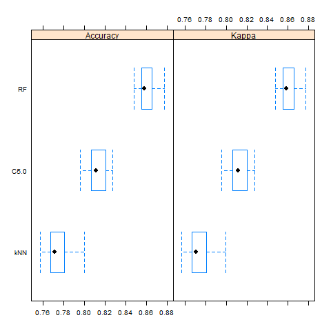
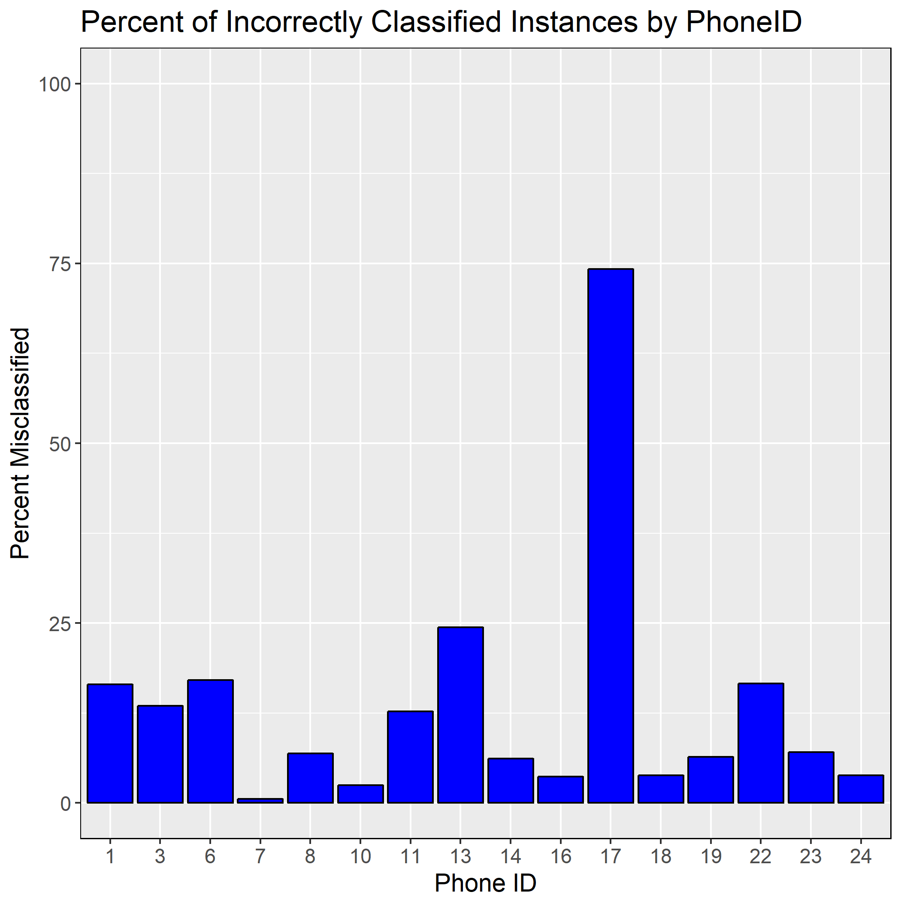

Wi-Fi Locationing
================

Abstract
--------

Unlike outdoor positioning, which uses GPS satellites, indoor locationing with a cell phone is a challenge due to poor or no access to satellite signals. An active area of research to address this problem utilizes signals from Wireless Access Points (WAPs) in a building. The approach covered in this project known as fingerprinting, uses a training set of locations in a building and the corresponding signal strength from all detected WAPs. In this way, a 'fingerprint' of WAP signal strength is produced for each position in a building. One challenge to this approach is that the received signal strength can vary based on the phone brand and model, and the position of the phone (i.e. the height of phone owner).

The goal of this project was to determine if a classification model can be built to identify a location in a building down to a level of granularity that would be useful. Namely, the model should be able to identify the location of the entrance to a room/space.

Methods
-------

The data set for this analysis is publicly available at the [UCI Machine Learning repository](http://archive.ics.uci.edu/ml/datasets/UJIIndoorLoc). The data was generated at a 3-building complex at Universitat Jaume I in Spain that covers ~110,000 m2. The data consists of 19,937 instances and 529 features. The first 520 features contain the received signal strength indicator value (RSSI) of wireless access points (WAPs) for an instance at a location. The remaining features contain additional location information along with user and phone information. The description of the features is summarized below.

<table class="table table-striped table-hover table-responsive table-bordered" style="font-size: 14px; width: auto !important; margin-left: auto; margin-right: auto;">
<caption style="font-size: initial !important;">
Attribute Definitions
</caption>
<thead>
<tr>
<th style="text-align:left;">
Attribute
</th>
<th style="text-align:left;">
Definition
</th>
</tr>
</thead>
<tbody>
<tr>
<td style="text-align:left;">
WAP001
</td>
<td style="text-align:left;">
Intensity value for WAP001. Negative integer values from -104 to 0 and +100. Positive value 100 used if WAP001 was not detected.
</td>
</tr>
<tr>
<td style="text-align:left;">
….
</td>
<td style="text-align:left;">
</td>
</tr>
<tr>
<td style="text-align:left;">
WAP520
</td>
<td style="text-align:left;">
Intensity value for WAP520. Negative integer values from -104 to 0 and +100. Positive Vvalue 100 used if WAP520 was not detected.
</td>
</tr>
<tr>
<td style="text-align:left;">
Longitude
</td>
<td style="text-align:left;">
Longitude. Negative real values from -7695.9387549299299000 to -7299.786516730871000
</td>
</tr>
<tr>
<td style="text-align:left;">
Latitude
</td>
<td style="text-align:left;">
Latitude. Positive real values from 4864745.7450159714 to 4865017.3646842018
</td>
</tr>
<tr>
<td style="text-align:left;">
Floor
</td>
<td style="text-align:left;">
Altitude in floors inside the building. Integer values from 0 to 4.
</td>
</tr>
<tr>
<td style="text-align:left;">
BuildingID
</td>
<td style="text-align:left;">
ID to identify the building. Measures were taken in three different buildings. Categorical integer values from 0 to 2.
</td>
</tr>
<tr>
<td style="text-align:left;">
SpaceID
</td>
<td style="text-align:left;">
Internal ID number to identify the Space (office, corridor, classroom) where the capture was taken. Categorical integer values.
</td>
</tr>
<tr>
<td style="text-align:left;">
RelativePosition
</td>
<td style="text-align:left;">
Relative position with respect to the Space (1 - Inside, 2 - Outside in Front of the door). Categorical integer values.
</td>
</tr>
<tr>
<td style="text-align:left;">
UserID
</td>
<td style="text-align:left;">
User identifier. Categorical integer values.
</td>
</tr>
<tr>
<td style="text-align:left;">
PhoneID
</td>
<td style="text-align:left;">
Android device identifier. Categorical integer values.
</td>
</tr>
<tr>
<td style="text-align:left;">
Timestamp
</td>
<td style="text-align:left;">
UNIX Time when the capture was taken. Integer value.
</td>
</tr>
</tbody>
</table>
One of the first orders of business was to devise an approach to creating a unique location ID that will become our categorical dependent variable. Again, with the goal of determining if a model could be built that would predict building location down to a useful granularity, the features Floor, BuildingID, SpaceID, and RelativePosition == 2 were grouped to create a unique location ID.

Another issue to address was what to do with the RSSI values where no signal was received. The number of WAPs received ranges from 0-51 so each Wi-Fi fingerprint contains &gt;469 null values. The RSSI values range from -104-0 dBm with 0 being the strongest signal. The original data set uses a value of +100 dBm to code for the absence of signal. However, it was decided that the value of -110 dBm would be used instead as that value is weaker than any in the data set.

A kNN, decision tree (C5.0), and a Random Forest classifier were built and the cross-validated performance was compared. The Random Forest classifier outperformed the other models with a CV accuracy of 86%.

 Taking a closer look at the percent misclassified by phone ID showed that phone ID 17 was a particularly poor performer. Almost 75% of the instances created by this phone were misclassified by the Random Forest model. Removal of instances related to this phone and retraining a Random Forest model resulted in a CV accuracy of 89%.

Requirements
------------

Package names and versions used for this analysis can be found in the requirements.txt file.
