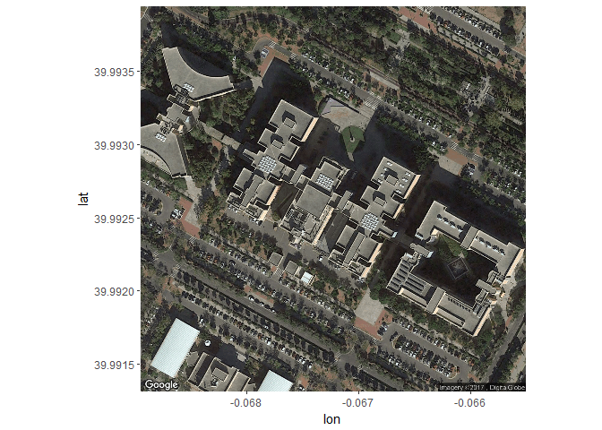

Wi-Fi Locationing
================

-   [**Introduction**](#introduction)
-   [**1. Frame the Problem**](#frame-the-problem)
-   [**2. Collect the Data**](#collect-the-data)
    -   [**2.1 Load Data Set**](#load-data-set)
    -   [**2.2 Inspect Data**](#inspect-data)
-   [**3. Process the Data**](#process-the-data)
-   [**4. Explore the Data**](#explore-the-data)
-   [**5. Build Predictive Models**](#build-predictive-models)
    -   [**5.1 kNN**](#knn)
        -   [**Fit kNN Model**](#fit-knn-model)
        -   [**Assess k-NN Model**](#assess-k-nn-model)
    -   [**5.2 Decision Tree**](#decision-tree)
        -   [**Fit Decision Tree Model**](#fit-decision-tree-model)
        -   [**Assess Decision Tree Model**](#assess-decision-tree-model)
    -   [**5.3 Random Forest**](#random-forest)
        -   [**Fit RF Model**](#fit-rf-model)
        -   [**Assess RF Model**](#assess-rf-model)
    -   [**5.4 Summary of Results**](#summary-of-results)
-   [**6 Explore Location Classification Results**](#explore-location-classification-results)
    -   [**6.1 Instances per Location**](#instances-per-location)
    -   [**6.2 WAPs Detected**](#waps-detected)
    -   [**6.3 Phone ID**](#phone-id)
-   [**7 Train Final Predictive Model**](#train-final-predictive-model)

**Introduction**
----------------

Unlike outdoor positioning which uses GPS satellites, indoor locationing with a cell phone is a challenge due to poor or no acccess to satellite signals. An active area of research to address this problem revolves around the use of signals from Wireless Access Points (WAP's) in a building. The approach covered in this project known as fingerprinting uses a training set of particular positions in a building and the corresponding signal strength from any and all WAP's in the vicinity. In this way, a 'fingerprint' of WAP signal strength is produced for each position in a building. One challenge to this approach is that the received signal strength can vary based on the phone brand and model, and the position of the phone (i.e. the height of phone owner).

This project will investigate classification models to predict the location (building, floor, and location ID) on the multi-building of Jaume I University. The data set is publicly available at the [UCI Machine Learning repository](http://archive.ics.uci.edu/ml/datasets/UJIIndoorLoc).

Due to the size of the data set, models were fit to the data using Amazon Web Services' (AWS) Elastic Compute Cloud (EC2).

**1. Frame the Problem**
------------------------

The data set contains over 933 reference points or distinct positions within the buildings. In addition to the received signal strength of the 520 possible WAP's, a fingerprint for a location contains the building, floor, SpaceID, relative position to the SpaceID, and the latitude/longitude coordinates. The SpaceID is essentially a room within a building while the relative position to the SpaceID is a location either inside the room or at the entrance in the hallway. It was initially decided to use only the the positions outside of a spaces as part of a location ID. To frame this as a classification problem, a unique location ID needs to be created for each reference point.

**2. Collect the Data**
-----------------------

First we'll load the packages that will be used in this analysis.

``` r
#-Load packages

library(caret)  #R modeling workhorse & ggplot2
library(tidyverse)  #Package for tidying datalibrary(magrittr)   #Enables piping
# library(Hmisc) #for descriptive statistics
library(parallel)
library(doParallel)
library(kknn)  #Weighted k-NN
library(kernlab)  #For SVMLinear method
library(rgl)  #for 3D plotting
library(scatterplot3d)
library(scales)
library(ranger)  #Random forest
library(C50)  #C5.0 decision tree with boosting
library(e1071)  #Random forest
# library(doMC)
library(broom)
library(kableExtra)
library(ggmap)
library(knitr)
```

### **2.1 Load Data Set**

The data is loaded into our working environment using the read\_csv() function from the readr package. This results in the data being stored as a tibble which is a data frame with some performance enhancements.

``` r
#-Training Data
wifi_data <- read_csv("trainingData.csv", na = "100")
dim(wifi_data)
```

The dim() function tells us the dimensions of the data set which has 19937 instances or rows and 529 features or columns.

### **2.2 Inspect Data**

We'll use the glimpse() funtion to get a quick look at the data. The output is a transposed version of the data with the columns shown as rows so it's possible to see all of the features if needed. In this case, we know the first 520 columns are the individual wireless access points (WAP's) so the data has been sliced to just show the last 20 features of the data set.

``` r
#-View last 20 features of data set
glimpse(wifi_data[, 510:529])
```

    ## Observations: 19,937
    ## Variables: 20
    ## $ WAP510           <chr> NA, NA, NA, NA, NA, NA, NA, NA, NA, NA, NA, N...
    ## $ WAP511           <int> NA, NA, NA, NA, NA, NA, NA, NA, NA, NA, NA, N...
    ## $ WAP512           <int> NA, NA, NA, NA, NA, NA, NA, NA, NA, NA, NA, N...
    ## $ WAP513           <chr> NA, NA, NA, NA, NA, NA, NA, NA, NA, NA, NA, N...
    ## $ WAP514           <chr> NA, NA, NA, NA, NA, NA, NA, NA, NA, NA, NA, N...
    ## $ WAP515           <chr> NA, NA, NA, NA, NA, NA, NA, NA, NA, NA, NA, N...
    ## $ WAP516           <int> NA, NA, NA, NA, NA, NA, NA, NA, NA, NA, NA, N...
    ## $ WAP517           <int> NA, NA, NA, NA, NA, NA, NA, NA, NA, NA, NA, N...
    ## $ WAP518           <int> NA, NA, NA, NA, NA, NA, NA, NA, NA, NA, NA, N...
    ## $ WAP519           <chr> NA, NA, NA, NA, NA, NA, NA, NA, NA, NA, NA, N...
    ## $ WAP520           <chr> NA, NA, NA, NA, NA, NA, NA, NA, NA, NA, NA, N...
    ## $ LONGITUDE        <dbl> -7541.264, -7536.621, -7519.152, -7524.570, -...
    ## $ LATITUDE         <dbl> 4864921, 4864934, 4864950, 4864934, 4864982, ...
    ## $ FLOOR            <int> 2, 2, 2, 2, 0, 2, 2, 2, 2, 2, 2, 2, 2, 2, 2, ...
    ## $ BUILDINGID       <int> 1, 1, 1, 1, 0, 1, 1, 1, 1, 1, 1, 1, 1, 1, 1, ...
    ## $ SPACEID          <chr> "106", "106", "103", "102", "122", "105", "10...
    ## $ RELATIVEPOSITION <int> 2, 2, 2, 2, 2, 2, 2, 2, 2, 1, 1, 2, 2, 2, 2, ...
    ## $ USERID           <int> 2, 2, 2, 2, 11, 2, 2, 2, 2, 2, 2, 2, 2, 2, 2,...
    ## $ PHONEID          <int> 23, 23, 23, 23, 13, 23, 23, 23, 23, 23, 23, 2...
    ## $ TIMESTAMP        <int> 1371713733, 1371713691, 1371714095, 137171380...

We can see that all of the reference point location information is found in the last 9 features. We can also see that there are several things that need to be addressed when we process the data. For instance, the second column above shows the data type for each feature. Several of them are strings (<chr>) when they should be numeric. There are going to be many missing values for the WAP readings which makes sense as only a small subset of the WAPs will be detected for each location. However, we'll need a strategy for how to deal with these missing values prior to building our predictive models.

``` r
#-Read in CSV file of Attribute Definitions
wifi_defTable <- read.csv("Wifi_Attribute_Definitions.csv")

#-Generate table of variable definitions
kable(wifi_defTable, caption = "Attribute Definitions") %>% kable_styling(bootstrap_options = c("striped", 
    "hover", "responsive", "bordered"), full_width = F, font_size = 14)
```

<table class="table table-striped table-hover table-responsive table-bordered" style="font-size: 14px; width: auto !important; margin-left: auto; margin-right: auto;">
<caption style="font-size: initial !important;">
Attribute Definitions
</caption>
<thead>
<tr>
<th style="text-align:left;">
Attribute
</th>
<th style="text-align:left;">
Definition
</th>
</tr>
</thead>
<tbody>
<tr>
<td style="text-align:left;">
WAP001
</td>
<td style="text-align:left;">
Intensity value for WAP001. Negative integer values from -104 to 0 and +100. Positive value 100 used if WAP001 was not detected.
</td>
</tr>
<tr>
<td style="text-align:left;">
….
</td>
<td style="text-align:left;">
</td>
</tr>
<tr>
<td style="text-align:left;">
WAP520
</td>
<td style="text-align:left;">
Intensity value for WAP520. Negative integer values from -104 to 0 and +100. Positive Vvalue 100 used if WAP520 was not detected.
</td>
</tr>
<tr>
<td style="text-align:left;">
Longitude
</td>
<td style="text-align:left;">
Longitude. Negative real values from -7695.9387549299299000 to -7299.786516730871000
</td>
</tr>
<tr>
<td style="text-align:left;">
Latitude
</td>
<td style="text-align:left;">
Latitude. Positive real values from 4864745.7450159714 to 4865017.3646842018
</td>
</tr>
<tr>
<td style="text-align:left;">
Floor
</td>
<td style="text-align:left;">
Altitude in floors inside the building. Integer values from 0 to 4.
</td>
</tr>
<tr>
<td style="text-align:left;">
BuildingID
</td>
<td style="text-align:left;">
ID to identify the building. Measures were taken in three different buildings. Categorical integer values from 0 to 2.
</td>
</tr>
<tr>
<td style="text-align:left;">
SpaceID
</td>
<td style="text-align:left;">
Internal ID number to identify the Space (office, corridor, classroom) where the capture was taken. Categorical integer values.
</td>
</tr>
<tr>
<td style="text-align:left;">
RelativePosition
</td>
<td style="text-align:left;">
Relative position with respect to the Space (1 - Inside, 2 - Outside in Front of the door). Categorical integer values.
</td>
</tr>
<tr>
<td style="text-align:left;">
UserID
</td>
<td style="text-align:left;">
User identifier. Categorical integer values.
</td>
</tr>
<tr>
<td style="text-align:left;">
PhoneID
</td>
<td style="text-align:left;">
Android device identifier. Categorical integer values.
</td>
</tr>
<tr>
<td style="text-align:left;">
Timestamp
</td>
<td style="text-align:left;">
UNIX Time when the capture was taken. Integer value.
</td>
</tr>
</tbody>
</table>
**3. Process the Data**
-----------------------

The first thing we'll do is convert all of our features to numeric data types. This results in a matrix which we'll then convert back into a tibble.

``` r
#-convert features to numeric
wifi_trainData <- sapply(wifi_data, as.numeric)  #-output is a matrix

#-Convert matrix to tibble
wifi_trainData <- as_tibble(wifi_trainData)
```

The floor numbers are in the range of 0-4 in the data set so we'll recode them so floor 1 is the ground floor rather than 0.

``` r
#-Recode floor factor level names
wifi_trainData$FLOOR <- recode(wifi_trainData$FLOOR, `0` = 1, `1` = 2, `2` = 3, 
    `3` = 4, `4` = 5)
```

Next, we'll convert several of the variables to categorical or qualitative using the factor() function.

``` r
#-Convert features to categorical 
wifi_trainData$BUILDINGID <- factor(wifi_trainData$BUILDINGID)
wifi_trainData$SPACEID <- factor(wifi_trainData$SPACEID)
wifi_trainData$RELATIVEPOSITION <- factor(wifi_trainData$RELATIVEPOSITION)
wifi_trainData$FLOOR <- factor(wifi_trainData$FLOOR)
```

It's likely that the number of WAPs detected by a phone at a location would be positively correlated with location classification accuracy. To be able to explore that idea, a column is added that contains the sum of WAPs detected.

``` r
#-Add count of WAP's detected as feature
wifi_trainData$WAP_num <- apply(wifi_trainData[, 1:520], 1, function(x) length(which(!is.na(x))))
```

Next, we'll filter the data set such that it only contains locations outside of spaces (i.e corridor).

``` r
#-Filter on hallway positions
wifi_trainData <- filter(wifi_trainData, wifi_trainData$RELATIVEPOSITION == 
    2)
```

To define a unique location ID for each location entrance in the 3 buildings, we'll use the group\_indices() function of dplyr. This will be our dependent variable for our classification models so we need to convert it to a categorical variable using the factor() function.

``` r
#-Consolidate position identifiers to create location ID feature
wifi_trainData$ID <- wifi_trainData %>% group_indices(BUILDINGID, FLOOR, SPACEID)

#-Convert ID variable to categorical
wifi_trainData$ID <- factor(wifi_trainData$ID)
```

To determine how many different classess we have for classification, we can use the nlevels() function on the ID variable.

``` r
#-Count of ID classes for classification
nlevels(wifi_trainData$ID)
```

    ## [1] 731

Next we'll remove any variables that contain only NA values.

``` r
#-Remove columns with all NA values
wifi_trainData <- wifi_trainData[, colSums(is.na(wifi_trainData[1:16608, ])) < 
    nrow(wifi_trainData[1:16608, ])]

#-Removes 76 columns
```

This results in the removal of 76 columns. We'll do the same for rows that contain no signal received from any of the 520 WAPs.

``` r
#-Remove rows with all NA values
wifi_trainData <- wifi_trainData[rowSums(is.na(wifi_trainData[, 1:444])) != 
    ncol(wifi_trainData[, 1:444]), ]
# removes 55 rows
```

Finally, we will address the many missing values in the data set which are currently a placeholder for the absence of a signal from a WAP. The values for the signal range from -104 to 0 dBm with 0 being the strongest signal and -104 being the weakest. The original data set used the value of +100 to code for the absence of signal. However, we'll use a value of -110 dBm to represent no signal from a WAP as it corresponds to a signal that is weaker than any WAP signal in the data set.

``` r
# convert NA's to -110
wifi_trainData[is.na(wifi_trainData)] <- -110
```

**4. Explore the Data**
-----------------------

Now that we've cleaned up the data set we'll prepare some visualizations to help us understand the data. The image below is a satellite picture of the 3-building complex where the Wi-Fi fingerprint data was obtained. The get\_map() and ggmap() functions were used to import and plot the image.

``` r
#-Define latitude and longitude coordinates for image location
locus = c(Lat = -0.067232, Lon = 39.992631)

#-Create satellite image
myMap <- get_map(location = locus, zoom = 18, source = "google", maptype = "satellite", 
    scale = "auto", crop = TRUE, color = "color")

#-Plot satellite image of buildings in data set
ggmap(myMap, extent = "panel")
```



We can use the latitude and longitude data in the data set to plot the location reference points of each building by floor. The builings (0, 1, and 2) are aligned left to right as they are shown in the satellite image.

``` r
# 3D image of reference point locations in data set

scatterplot3d(wifi_trainData$LONGITUDE, wifi_trainData$LATITUDE, wifi_trainData$FLOOR, 
    type = "p", highlight.3d = FALSE, color = "blue", angle = 155, pch = 16, 
    box = FALSE, main = "Location Reference Points Across Three Buildings of UJIIndoorLoc Data Set", 
    cex.lab = 1, cex.main = 1, cex.sub = 1, col.sub = "blue", xlab = "Longitude", 
    ylab = "Latitude", zlab = "Building Floor")
```


To get a sense for how many examples or instances there are for each of our classification classes, we can use the table() function on the ID variable. Since there are 731 different locations, it's difficult to interpret the output so we'll plot the distribution as a histogram.

``` r
#-Create data frame of instance counts per location 
ID_freq <- as.data.frame(table(wifi_trainData$ID))

#-Plot histogram of instance counts at locations
ggplot(ID_freq, aes(x = Freq)) + geom_histogram(fill = "green", binwidth = 2, 
    color = "black") + scale_x_continuous(breaks = seq(0, 100, 10)) + ggtitle("Frequency Count of Location ID Instances") + 
    xlab("Number of Instances for a Loacation ID") + ylab("Frequency of Observed Instance Count") + 
    theme(text = element_text(size = 14)) + theme(panel.border = element_rect(colour = "black", 
    fill = NA))
```

 The instance count for locations ranges from a minumum of 2 to a maximum of 90 with 20 being the most common number of instances for a location.

We can also visualize how the number of WAPs detected varies across the 3 buildings and across floors. The boxplot below shows the distribution of WAPs across the buildings. Building 3 has the highest median detected WAPs whereas Building 0 and 1 appear to have similar medians. The distribution in building 1 also reaches to the lower end of WAPs detected relative to the other buildings.

``` r
#-Distribution of WAP count by building- boxplot
ggplot(wifi_trainData, aes(x = BUILDINGID, y = WAP_num)) + geom_boxplot(fill = "lightblue") + 
    theme(text = element_text(size = 14)) + ggtitle("Distribution of Detected Wireless Access Points by Building") + 
    labs(x = "Building Number", y = "WAP Counts") + theme(panel.border = element_rect(colour = "black", 
    fill = NA))
```

 We can also look at the distribution of WAPs detected by building and floor. The resulting histogram shows some slight differences between buildings. For one, building 2 is the only one with a 5th floor and it also has spikes in WAPs detected at 17 and 28. The distribution of WAPs detected in building 1 is more spread out than the other buildings with more occcurences of WAPs detected at the low end. We can look back after running our predictive models to see if there is any relationship between the number of WAPs detected and accuracy.

``` r
# Distribution of WAP count by building and floor
ggplot(wifi_trainData, aes(x = WAP_num, fill = FLOOR)) + geom_bar() + facet_grid(BUILDINGID ~ 
    .) + theme(text = element_text(size = 14)) + ggtitle("Distribution of Detected Wireless Access Points by Building") + 
    labs(x = "Number of WAP's Detected by Building", y = "Counts by Building Floor") + 
    theme(panel.border = element_rect(colour = "black", fill = NA))
```


**5. Build Predictive Models**
------------------------------

Now that we've cleaned and visualized the data, we can remove attributes that won't be needed in a predictive model. In the end, all we will need is our dependent variable (ID) and the 520 WAP variables that make up the Wi-Fi fingerprint for the location ID.

``` r
#-Remove unneeded variables prior to model fitting
wifi_train <- select(wifi_trainData, -RELATIVEPOSITION, -USERID, -WAP_num, -PHONEID, 
    -TIMESTAMP, -LONGITUDE, -LATITUDE, -BUILDINGID, -SPACEID, -FLOOR)
```

Using the trainControl() function, we can set many paramaters used in the model fitting step by the train() function. The *method* argument sets the resampling technique which in this case is repeated cross validation (CV) or repeatedcv. The *number* argument sets the number of folds in the k-fold-CV which will then be repeated 3 times. The final parameter allows us to reproducibly set the seed for work going on during parallel processing.

``` r
#-Assign values in seeds agrument of trainControl
set.seed(123)
seeds <- vector(mode = "list", length = 31)
for (i in 1:30) seeds[[i]] <- sample.int(1000, 518)

# for last model:
seeds[[31]] <- sample.int(1000, 1)

#-Define parameters in trainControl
fitControl <- trainControl(method = "repeatedcv", number = 10, repeats = 3, 
    allowParallel = TRUE, seeds = seeds)
```

We will look at three different classification models starting with k-nearest neighbor.

### **5.1 kNN**

We'll use a grid search to look at values of k ranging from 1 to 5. After training the model, we can save it using the saveRDS() function.

#### **Fit kNN Model**

``` r
#-Fit kNN model
# registerDoMC(cores=16) #-for parallel processing as AWS EC2 instance
set.seed(7811)

#-Grid of k values to search 
knn_grid <- expand.grid(.k = c(1:5))

#-Train kNN model
knn_fit <- train(ID ~ ., data = wifi_train, method = "knn", preProcess = c("zv"), 
    tuneGrid = knn_grid, trControl = fitControl)

#-Save model
knn_fit <- saveRDS(knn_fit, "knn_fit.rds")
```

#### **Assess k-NN Model**

The plot below shows the cross validated accuracy as it relates to the number of neighbors for the k-NN model. The best result was observed at k=1 with 77.4% accuracy.

``` r
#-Read in model and view results
knn_fit <- readRDS("knn_fit.rds")
```

``` r
plot(knn_fit)
```


``` r
knn_fit$results
```

    ##   k  Accuracy     Kappa AccuracySD    KappaSD
    ## 1 1 0.7737787 0.7734021 0.01089151 0.01090988
    ## 2 2 0.7443593 0.7439336 0.01044924 0.01046715
    ## 3 3 0.7608947 0.7604953 0.01118297 0.01120191
    ## 4 4 0.7525763 0.7521620 0.01185879 0.01187938
    ## 5 5 0.7505212 0.7501031 0.01116237 0.01118191

### **5.2 Decision Tree**

Next we will try a tree-based classifier and save the model with the saveRDS() function.

#### **Fit Decision Tree Model**

``` r
#-Train decision tree (C5.0) model

# registerDoMC(cores=16) #-for parallel processing as AWS EC2 instance
set.seed(7811)

#-Train decision tree model
dtree_fit <- train(ID ~ ., wifi_train, method = "C5.0", preProcess = c("zv"), 
    trControl = fitControl)

#-Save model
dtree_fit <- saveRDS(dtree_fit, "dtree_fit.rds")
```

#### **Assess Decision Tree Model**

We can see from the graphical output that there may still be room for improvement as the CV accuracy is still trending upwards. We could use a grid search to explore larger number of trials or boosting iterations.

``` r
#-Read in decision tree model and view results.
dtree_fit <- readRDS("dtree_fit.rds")
```

``` r
plot(dtree_fit)
```


``` r
dtree_fit$results
```

    ##    model winnow trials  Accuracy     Kappa  AccuracySD     KappaSD
    ## 7  rules  FALSE      1 0.6906878 0.6901702 0.011806984 0.011827448
    ## 10 rules   TRUE      1 0.6934668 0.6929544 0.012008877 0.012027618
    ## 1   tree  FALSE      1 0.6916375 0.6911262 0.011303188 0.011320763
    ## 4   tree   TRUE      1 0.6935906 0.6930817 0.010264308 0.010280356
    ## 8  rules  FALSE     10 0.7995182 0.7991857 0.010164980 0.010182433
    ## 11 rules   TRUE     10 0.7981494 0.7978147 0.008237887 0.008251775
    ## 2   tree  FALSE     10 0.7975227 0.7971846 0.008161160 0.008174447
    ## 5   tree   TRUE     10 0.7970560 0.7967174 0.009447221 0.009462578
    ## 9  rules  FALSE     20 0.8123411 0.8120305 0.008930684 0.008945367
    ## 12 rules   TRUE     20 0.8098081 0.8094932 0.008642375 0.008656601
    ## 3   tree  FALSE     20 0.8102934 0.8099763 0.008965775 0.008980841
    ## 6   tree   TRUE     20 0.8089811 0.8086619 0.009073024 0.009088444

### **5.3 Random Forest**

Finally, we'll take a look at a Random Forest classifier.

#### **Fit RF Model**

We'll use the ranger package to train a Random Forest model which is a good choice for high dimensional data.

``` r
#-Train Random Forest model

registerDoMC(cores = 16)  #-for parallel processing as AWS EC2 instance
set.seed(7811)

#-Train Random Forest model
rf_fit <- train(ID ~ ., wifi_train, method = "ranger", preProcess = c("zv"), 
    trControl = fitControl)

#-Save model
rf_fit <- saveRDS(rf_fit, "rf_fit.rds")
```

#### **Assess RF Model**

The Random Forest model reached a cross validated accuracy of 86%.

``` r
#-Read in Random Forest model and view results
rf_fit <- readRDS("rf_fit.rds")
```

``` r
plot(rf_fit)
```


``` r
rf_fit$results
```

    ##   mtry min.node.size  splitrule  Accuracy     Kappa  AccuracySD
    ## 1    2             1       gini 0.1310483 0.1281586 0.004996070
    ## 2    2             1 extratrees 0.1202186 0.1169993 0.004601137
    ## 3  223             1       gini 0.8555568 0.8553156 0.006336570
    ## 4  223             1 extratrees 0.8606894 0.8604564 0.007844801
    ## 5  444             1       gini 0.8431127 0.8428509 0.009169612
    ## 6  444             1 extratrees 0.8589462 0.8587094 0.008973954
    ##       KappaSD
    ## 1 0.005033796
    ## 2 0.004652861
    ## 3 0.006347007
    ## 4 0.007857965
    ## 5 0.009186012
    ## 6 0.008989344

### **5.4 Summary of Results**

We can compare the results of our predictive models by using the resamples() function and then creating a plot.

``` r
#-Summarize results of predictive models
results <- resamples(list(kNN = knn_fit, RF = rf_fit, C5.0 = dtree_fit))

summary(results)
```

    ## 
    ## Call:
    ## summary.resamples(object = results)
    ## 
    ## Models: kNN, RF, C5.0 
    ## Number of resamples: 30 
    ## 
    ## Accuracy 
    ##           Min.   1st Qu.    Median      Mean   3rd Qu.      Max. NA's
    ## kNN  0.7572115 0.7674454 0.7713729 0.7737787 0.7806689 0.8000000    0
    ## RF   0.8478261 0.8553706 0.8584365 0.8606894 0.8655526 0.8774894    0
    ## C5.0 0.7958937 0.8068055 0.8116119 0.8123411 0.8203770 0.8276070    0
    ## 
    ## Kappa 
    ##           Min.   1st Qu.    Median      Mean   3rd Qu.      Max. NA's
    ## kNN  0.7568085 0.7670568 0.7709893 0.7734021 0.7803057 0.7996681    0
    ## RF   0.8475730 0.8551290 0.8581995 0.8604564 0.8653276 0.8772851    0
    ## C5.0 0.7955575 0.8064856 0.8113023 0.8120305 0.8200794 0.8273233    0

``` r
bwplot(results)
```

 We can see that the Random Forest model outperformed the decision tree (C5.0) and k-NN models.

**6 Explore Location Classification Results**
---------------------------------------------

### **6.1 Instances per Location**

Using the Random Forest model, we can try to understand what is driving the incorrect classification of locations.

``` r
#-Select instances that were correctly classifed in rf model
rf_hit <- wifi_trainData[which(rf_fit$finalModel$predictions == wifi_train$ID), 
    ]

rf_hit$ID <- factor(rf_hit$ID)  #-Remove empty factor levels
nlevels(rf_hit$ID)  #726 levels

#-Select instances that were incorrectly classifed in rf model
rf_mis <- wifi_trainData[which(rf_fit$finalModel$predictions != wifi_train$ID), 
    ]

rf_mis$ID <- factor(rf_mis$ID)  #-Remove empty factor levels
nlevels(rf_mis$ID)  #598 levels
```

We can look at the distribution of instance counts for correctly and incorrectly classified instances. First we'll make data frames of instance counts for correctly and incorrectly classified locations.

``` r
#-Create data frames of instance counts at locations for correctly and incorrectly classified
ID_hitFreq <- as.data.frame(table(rf_hit$ID))
ID_misFreq <- as.data.frame(table(rf_mis$ID))
```

We can then overlay the distributions in the same plot.

``` r
#-Plot distribution of Instance Counts for Locations
ggplot(ID_hitFreq, aes(x = Freq, fill = "Correct")) + geom_histogram(binwidth = 2) + 
    geom_histogram(data = ID_misFreq, aes(x = Freq, fill = "Incorrect"), alpha = 0.4, 
        binwidth = 2) + scale_fill_manual(values = c(Correct = "green", Incorrect = "blue")) + 
    labs(fill = "Prediction") + theme(panel.border = element_rect(colour = "black", 
    fill = NA)) + ggtitle("Distribution of Instances per Location") + xlab("Number of Instances per Location")
```

 Clearly, locations with more instances in the data set were more likely to be correctly classified. We can run a t-test to determine if the difference in means of the instance counts is statistically significant.

``` r
#-T-Test on means of instance counts for locations correctly/incorrectly classified
t.test(ID_hitFreq$Freq, ID_misFreq$Freq, alternative = "two.sided", conf.level = 0.95)
```

    ## 
    ##  Welch Two Sample t-test
    ## 
    ## data:  ID_hitFreq$Freq and ID_misFreq$Freq
    ## t = 38.638, df = 910.12, p-value < 2.2e-16
    ## alternative hypothesis: true difference in means is not equal to 0
    ## 95 percent confidence interval:
    ##  14.68608 16.25785
    ## sample estimates:
    ## mean of x mean of y 
    ## 19.490358  4.018395

Based on the result of the t-test, we can say with &gt;95% confidence that the difference in means of the instance counts for correctly and incorrectly classifed examples is statistically signifcant.

### **6.2 WAPs Detected**

To see if the WAPs detected is different for correctly and incorrectly classified locations, we'll plot the distribution of WAPs detected for each of those cases.

``` r
#-Plot distribution of WAP counts for correctly/incorrectly classified
ggplot(rf_hit, aes(WAP_num, fill = "Correct")) + geom_histogram(binwidth = 2) + 
    geom_histogram(data = rf_mis, aes(WAP_num, fill = "Incorrect"), alpha = 0.7, 
        binwidth = 2) + scale_fill_manual(values = c(Correct = "green", Incorrect = "blue")) + 
    labs(fill = "Prediction") + theme(panel.border = element_rect(colour = "black", 
    fill = NA)) + ggtitle("Distribution of WAPs detected per Location") + xlab("Number of WAPs per Location")
```

 It seems that the number of WAPs detected has nothing to do with whether or not a location is correctly or incorrectly predicted by our Random Forest model.

### **6.3 Phone ID**

We can also look to see if particular phones used to build the data set were any more likely to lead to misclassified locations. We'll do this by visualizing the percent misclassified by phone ID.

``` r
#-Make data frame of counts for correctly classified by phoneID
phone_hit <- tidy(table(rf_hit$PHONEID))
#-Assign new column names
names(phone_hit) <- c("PhoneID", "Count_hit")


#-Make data frame of counts for incorrectly classified by phoneID
phone_mis <- tidy(table(rf_mis$PHONEID))
#-Assign new column names
names(phone_mis) <- c("PhoneID", "Count_miss")

#-Merge data frames
x <- merge(x = phone_hit, y = phone_mis, by = "PhoneID")

#-Add column for percent missed by phoneID
y <- mutate(x, Percent_miss = round(Count_miss/(Count_miss + Count_hit) * 100, 
    3))
```

Plotting the percent misclassified by phone ID shows that phone ID 17 was a particularly poor performer. In fact, that phone resulted in almost 75% misclassified locations.

``` r
#-Plot percent miscalssified by phone ID
ggplot(y, aes(x = factor(PhoneID), y = Percent_miss)) + geom_bar(stat = "identity", 
    fill = "blue", colour = "black") + ggtitle("Percent of Incorrectly Classified Instances by PhoneID") + 
    xlab("Phone ID") + ylab("Percent Misclassified") + ylim(0, 100) + theme(panel.border = element_rect(colour = "black", 
    fill = NA))
```

 Looking at the descriptions for the phones used in the preparation of the data set, we can see that the phone with an ID=17 is an Android device with the model number M10005D.

``` r
#-Prepare table of phoneID
phoneID_table <- read.csv("PhoneID_model_descrip.csv")

#-Generate table of phoneID and model
kable(phoneID_table) %>% kable_styling(bootstrap_options = c("striped", "hover", 
    "responsive", "bordered"), full_width = F, font_size = 14) %>% row_spec(18, 
    bold = T, background = "yellow")
```

<table class="table table-striped table-hover table-responsive table-bordered" style="font-size: 14px; width: auto !important; margin-left: auto; margin-right: auto;">
<thead>
<tr>
<th style="text-align:right;">
PhoneID
</th>
<th style="text-align:left;">
Android.Device
</th>
<th style="text-align:left;">
Android.Ver
</th>
<th style="text-align:left;">
UserID
</th>
</tr>
</thead>
<tbody>
<tr>
<td style="text-align:right;">
0
</td>
<td style="text-align:left;">
Celkon A27
</td>
<td style="text-align:left;">
4.0.4(6577)
</td>
<td style="text-align:left;">
0
</td>
</tr>
<tr>
<td style="text-align:right;">
1
</td>
<td style="text-align:left;">
GT-I8160
</td>
<td style="text-align:left;">
2.3.6
</td>
<td style="text-align:left;">
8
</td>
</tr>
<tr>
<td style="text-align:right;">
2
</td>
<td style="text-align:left;">
GT-I8160
</td>
<td style="text-align:left;">
4.1.2
</td>
<td style="text-align:left;">
0
</td>
</tr>
<tr>
<td style="text-align:right;">
3
</td>
<td style="text-align:left;">
GT-I9100
</td>
<td style="text-align:left;">
4.0.4
</td>
<td style="text-align:left;">
5
</td>
</tr>
<tr>
<td style="text-align:right;">
4
</td>
<td style="text-align:left;">
GT-I9300
</td>
<td style="text-align:left;">
4.1.2
</td>
<td style="text-align:left;">
0
</td>
</tr>
<tr>
<td style="text-align:right;">
5
</td>
<td style="text-align:left;">
GT-I9505
</td>
<td style="text-align:left;">
4.2.2
</td>
<td style="text-align:left;">
0
</td>
</tr>
<tr>
<td style="text-align:right;">
6
</td>
<td style="text-align:left;">
GT-S5360
</td>
<td style="text-align:left;">
2.3.6
</td>
<td style="text-align:left;">
7
</td>
</tr>
<tr>
<td style="text-align:right;">
7
</td>
<td style="text-align:left;">
GT-S6500
</td>
<td style="text-align:left;">
2.3.6
</td>
<td style="text-align:left;">
14
</td>
</tr>
<tr>
<td style="text-align:right;">
8
</td>
<td style="text-align:left;">
Galaxy Nexus
</td>
<td style="text-align:left;">
4.2.2
</td>
<td style="text-align:left;">
10
</td>
</tr>
<tr>
<td style="text-align:right;">
9
</td>
<td style="text-align:left;">
Galaxy Nexus
</td>
<td style="text-align:left;">
4.3
</td>
<td style="text-align:left;">
0
</td>
</tr>
<tr>
<td style="text-align:right;">
10
</td>
<td style="text-align:left;">
HTC Desire HD
</td>
<td style="text-align:left;">
2.3.5
</td>
<td style="text-align:left;">
18
</td>
</tr>
<tr>
<td style="text-align:right;">
11
</td>
<td style="text-align:left;">
HTC One
</td>
<td style="text-align:left;">
4.1.2
</td>
<td style="text-align:left;">
15
</td>
</tr>
<tr>
<td style="text-align:right;">
12
</td>
<td style="text-align:left;">
HTC One
</td>
<td style="text-align:left;">
4.2.2
</td>
<td style="text-align:left;">
0
</td>
</tr>
<tr>
<td style="text-align:right;">
13
</td>
<td style="text-align:left;">
HTC Wildfire S
</td>
<td style="text-align:left;">
2.3.5
</td>
<td style="text-align:left;">
0, 11
</td>
</tr>
<tr>
<td style="text-align:right;">
14
</td>
<td style="text-align:left;">
LT22i
</td>
<td style="text-align:left;">
4.0.4
</td>
<td style="text-align:left;">
0,1,9,16
</td>
</tr>
<tr>
<td style="text-align:right;">
15
</td>
<td style="text-align:left;">
LT22i
</td>
<td style="text-align:left;">
4.1.2
</td>
<td style="text-align:left;">
0
</td>
</tr>
<tr>
<td style="text-align:right;">
16
</td>
<td style="text-align:left;">
LT26i
</td>
<td style="text-align:left;">
4.0.4
</td>
<td style="text-align:left;">
3
</td>
</tr>
<tr>
<td style="text-align:right;font-weight: bold;background-color: yellow;">
17
</td>
<td style="text-align:left;font-weight: bold;background-color: yellow;">
M1005D
</td>
<td style="text-align:left;font-weight: bold;background-color: yellow;">
4.0.4
</td>
<td style="text-align:left;font-weight: bold;background-color: yellow;">
13
</td>
</tr>
<tr>
<td style="text-align:right;">
18
</td>
<td style="text-align:left;">
MT11i
</td>
<td style="text-align:left;">
2.3.4
</td>
<td style="text-align:left;">
4
</td>
</tr>
<tr>
<td style="text-align:right;">
19
</td>
<td style="text-align:left;">
Nexus 4
</td>
<td style="text-align:left;">
4.2.2
</td>
<td style="text-align:left;">
6
</td>
</tr>
<tr>
<td style="text-align:right;">
20
</td>
<td style="text-align:left;">
Nexus 4
</td>
<td style="text-align:left;">
4.3
</td>
<td style="text-align:left;">
0
</td>
</tr>
<tr>
<td style="text-align:right;">
21
</td>
<td style="text-align:left;">
Nexus S
</td>
<td style="text-align:left;">
4.1.2
</td>
<td style="text-align:left;">
0
</td>
</tr>
<tr>
<td style="text-align:right;">
22
</td>
<td style="text-align:left;">
Orange Monte Carlo
</td>
<td style="text-align:left;">
2.3.5
</td>
<td style="text-align:left;">
17
</td>
</tr>
<tr>
<td style="text-align:right;">
23
</td>
<td style="text-align:left;">
Transformer TF101
</td>
<td style="text-align:left;">
4.0.3
</td>
<td style="text-align:left;">
2
</td>
</tr>
<tr>
<td style="text-align:right;">
24
</td>
<td style="text-align:left;">
bq Curie
</td>
<td style="text-align:left;">
4.1.1
</td>
<td style="text-align:left;">
12
</td>
</tr>
</tbody>
</table>
We showed earlier that the number of instances per location was positively correlated with classification accuracy. To see if that is what is driving the poor accuracy with this particular phone, we can look at the distribution of instances for misclassified examples.

``` r
#-Select only misclassified examples with phoneID=17 
phone_mis17 <- filter(rf_mis, PHONEID == 17)
phone_mis17$ID <- factor(phone_mis17$ID)  #remove empty factor levels
```

``` r
#-Create data frame of instance counts for locations misclassified by phoneID=17

phone_misFreq <- as.data.frame(table(phone_mis17$ID))
```

``` r
#-Plot instance counts for misclassified locations by phoneID 17

ggplot(phone_misFreq, aes(x = Freq)) + geom_histogram(binwidth = 2, fill = "blue") + 
    xlab("Number of Instances per Location") + ggtitle("Number of Instances at Misclassified Locations with PhoneID 17") + 
    theme(panel.border = element_rect(colour = "black", fill = NA))
```

 The number of instances does not seem to be driving the poor accuracy obtained with PhoneID 17. This phone does seem to be a legitemite outlier so we will remove its contribution to the data set and retrain the Random Forest model.

``` r
s3d <- scatterplot3d(phone_mis17$LONGITUDE, phone_mis17$LATITUDE, phone_mis17$FLOOR, 
    type = "p", highlight.3d = FALSE, color = "blue", angle = 130, pch = 5, 
    box = FALSE, zlim = c(1, 5), main = "Misclassified Locations by PhoneID 17", 
    sub = "Random Forest Model", xlab = "Longitude", ylab = "Latitude", zlab = "Floor", 
    cex.lab = 1.5, cex.main = 1.5, cex.sub = 1.5, col.sub = "blue")
```


**7 Train Final Predictive Model**
----------------------------------

``` r
#-Remove data for phoneID 17 from data set
wifi_trainData_Tsf <- filter(wifi_trainData, PHONEID != 17)
wifi_trainData_Tsf$ID <- factor(wifi_trainData_Tsf$ID)  #-remove empty factor levels
```

``` r
#-Train Random Forest model 

# registerDoMC(cores=16) #-for parallel processing AWS EC2 instance

set.seed(7811)

rf_fit2 <- train(ID ~ ., wifi_trainData_Tsf, method = "ranger", preProcess = c("zv"), 
    trControl = fitControl)

#-Save model
rf_fit2 <- saveRDS(rf_fit2, "rf_fit2.rds")
```

``` r
#-Read in Random Forest model and view results
rf_fit2 <- readRDS("rf_fit2.rds")
```

``` r
plot(rf_fit2)
```


``` r
rf_fit2$results
```

    ##   mtry min.node.size  splitrule  Accuracy     Kappa  AccuracySD
    ## 1    2             1       gini 0.1353435 0.1324916 0.006052079
    ## 2    2             1 extratrees 0.1252251 0.1221055 0.007401948
    ## 3  223             1       gini 0.8844273 0.8842288 0.008549918
    ## 4  223             1 extratrees 0.8898457 0.8896560 0.007759211
    ## 5  444             1       gini 0.8697349 0.8695111 0.005350444
    ## 6  444             1 extratrees 0.8854131 0.8852159 0.002336204
    ##       KappaSD
    ## 1 0.006089357
    ## 2 0.007463092
    ## 3 0.008564744
    ## 4 0.007772672
    ## 5 0.005360073
    ## 6 0.002339195
